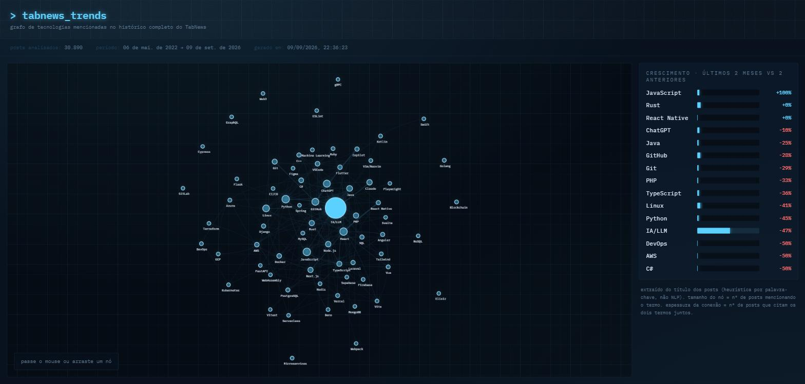

# tabnews_trends

Grafo interativo das tecnologias mais mencionadas no [TabNews](https://www.tabnews.com.br/), extraído do histórico completo de posts via API pública.



## Rodando local

```bash
npm install
npm run fetch   # busca o histórico completo do TabNews e gera src/data/tabnews-trends.json
npm run dev     # abre em http://localhost:5173
```

`npm run fetch` pagina a API pública (`/api/v1/contents`) inteira, com retry/backoff em rate limit (429) e cache local (`posts-cache.json`, 6h) pra não rebuscar tudo a cada troca de keyword.

## Como funciona

- Extrai termos técnicos do **título** dos posts por casamento de palavra-chave (`scripts/keywords.mjs`) — heurística simples, não NLP.
- Tamanho do nó = nº de posts mencionando o termo. Espessura da conexão = nº de posts que citam os dois termos juntos.
- Painel lateral mostra os termos com maior variação (últimos 2 meses vs. 2 anteriores).

## Stack

Vite + React + TypeScript, Tailwind, [vis-network](https://github.com/visjs/vis-network) pro grafo (física `forceAtlas2Based`).

## Licença

MIT — mesmo espírito do [repositório do TabNews](https://github.com/filipedeschamps/tabnews.com.br).
